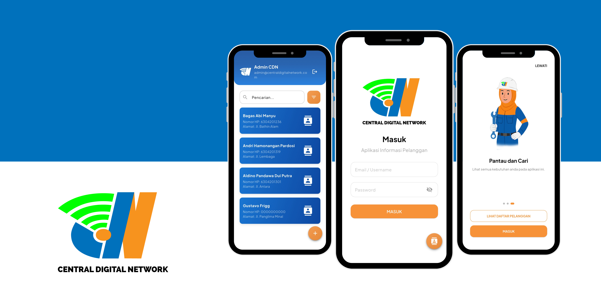

##

### Aplikasi Informasi Pelanggan PT. Central Digital Network

## 📙 Description

Aplikasi Informasi Pelanggan PT. Central Digital Network is an application designed to record, display, and manage customer list information at PT. Central Digital Network, especially for customer data monitoring needs.

## 📖 Features

Interesting features of Aplikasi Informasi Pelanggan PT. Central Digital Network:

1. **Authentication** : Admin can log in to the application via a registered account.

2. **CRUD Data** : Admin can add, view, change, search, and delete customer data, to support efficient customer data monitoring.
